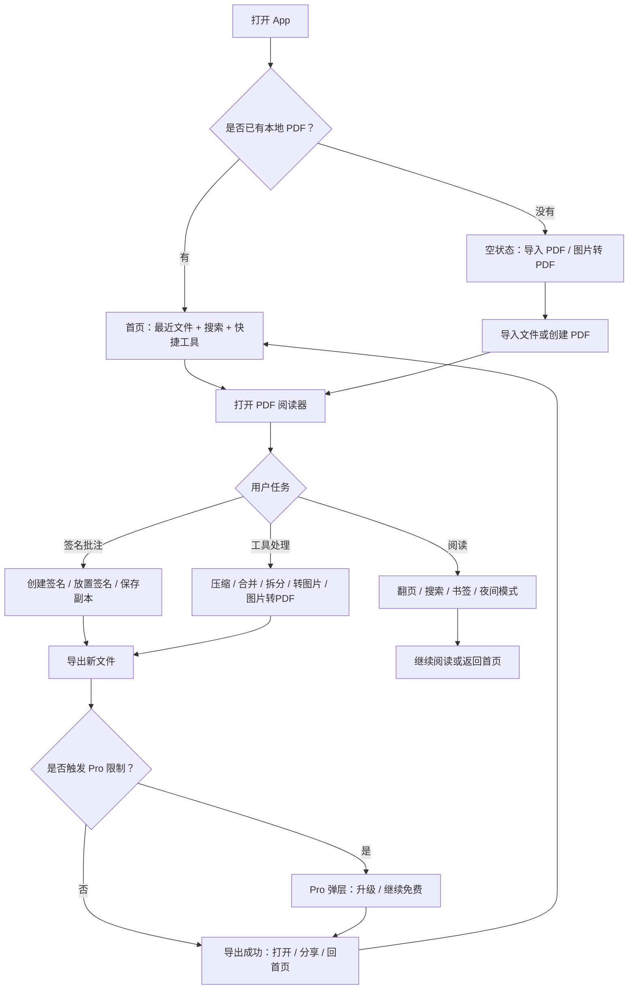

# SwiftPDF Android MVP 设计规格

更新时间：2026-05-22

## 1. 产品目标

SwiftPDF 是一个面向 Android 用户的轻量 PDF 阅读与工具 App。第一版目标不是做“大而全 PDF Office”，而是先跑通高频任务闭环：

- 快速找到并打开本地 PDF。
- 在阅读器里完成基础阅读、搜索、书签、夜间模式。
- 支持图片转 PDF、签名、压缩、合并、拆分、PDF 转图片等高频工具入口。
- 所有编辑类操作默认保存为副本，不覆盖原文件。
- Pro 只在用户触发限制或高级能力时出现，不做首次启动强制付费墙。

## 2. MVP 第一版范围

### 必做

- 首页：最近文件、搜索、快捷工具、空状态。
- 阅读器：打开 PDF、页码、跳页、缩放、搜索、书签、夜间模式、底部工具栏。
- 工具箱：Image to PDF、Sign PDF、Compress、Merge、Split、PDF to Image 六个入口。
- Image to PDF：相册多选、拍照导入、排序、裁剪、预览、导出 PDF。
- 签名：手写签名、图片导入签名、放置到 PDF、保存副本。
- 导出完成页：打开、分享、回到首页。
- Pro 限制页：只在免费次数用完、高质量导出、批量处理、签名库等场景触发，并保留继续免费路径。

### 暂缓

- 云同步。
- OCR。
- 高级 PDF 编辑器。
- 多端账号系统。
- 企业协作。
- 复杂模板市场。

## 3. 核心流程图



## 4. 信息架构

```text
SwiftPDF
├─ Home
│  ├─ Recent files
│  ├─ Search
│  ├─ Quick tools
│  └─ Empty state
├─ Reader
│  ├─ PDF viewing
│  ├─ Search / bookmark / jump page
│  ├─ Sign / annotate
│  └─ Toolbox entry
├─ Toolbox
│  ├─ Image to PDF
│  ├─ Sign PDF
│  ├─ Compress
│  ├─ Merge PDF
│  ├─ Split PDF
│  └─ PDF to Image
├─ Export Result
│  ├─ Success
│  ├─ Open
│  └─ Share
└─ Pro
   ├─ Limit prompt
   ├─ Premium quality prompt
   └─ Continue free
```

## 5. 页面设计规格

### 5.1 Home 首页

目标：让用户两步内进入阅读或工具任务。

默认状态：

- 顶部显示 SwiftPDF 标识和设置/Pro 入口。
- 搜索框支持按 PDF 名称、工具名、文件夹名搜索。
- 快捷工具显示 Image to PDF、Sign PDF、Compress、Merge、Split、PDF to Image。
- 最近文件列表展示文件名、大小、页数、最近打开时间。
- 文件行支持更多菜单：重命名、分享、删除、文件信息。

空状态：

- 文案：No local PDFs yet。
- 主按钮：Import PDF。
- 次入口：Image to PDF。
- 不出现 Pro 付费墙。

权限状态：

- 首次扫描本地文件时再请求权限。
- 权限说明强调只扫描本地文档，帮助用户快速查找和打开文件。

### 5.2 Reader 阅读器

目标：阅读是默认主任务，编辑动作从阅读器自然进入。

页面结构：

- 顶部：返回、文件名、当前页码、更多菜单。
- 中部：PDF 页面渲染区域。
- 底部：页码进度、搜索、书签、签名、批注、工具箱。

核心能力：

- 缩放。
- 连续滚动。
- 跳页。
- 搜索。
- 书签。
- 夜间模式。
- 签名和批注入口。

错误状态：

- PDF 加载失败时提供 Retry、Open with another app。
- 保留返回首页路径。

### 5.3 Toolbox 工具箱

目标：集中承接高频 PDF 工具，不做复杂办公套件。

工具顺序：

1. Image to PDF。
2. Sign PDF。
3. Compress。
4. Merge PDF。
5. Split PDF。
6. PDF to Image。

设计原则：

- 每个工具使用图标优先的卡片。
- 工具说明要短，强调当前任务。
- Pro 标签只标注高级质量、批量处理或无限次数。

### 5.4 Image to PDF

目标：把图片、截图、票据、课堂笔记快速整理成 PDF。

流程：

1. 选择相册图片或拍照导入。
2. 展示已选图片列表。
3. 支持拖拽排序、裁剪、删除。
4. 进入预览。
5. 导出 PDF。
6. 导出完成后提供打开和分享。

免费限制：

- 免费用户每日 3 次导出。
- 达到限制后展示 Pro 弹层，同时保留 Continue free。

### 5.5 Sign PDF

目标：让用户在手机上快速完成合同、表格、作业等文件签名。

流程：

1. 创建签名：手写或从图片导入。
2. 调整颜色、清除、撤销。
3. 放置到 PDF 页面。
4. 拖动、缩放、确认。
5. 保存为副本。

原则：

- 默认保存副本。
- 不覆盖原 PDF。
- 签名库、多签名保存可作为 Pro 能力。

### 5.6 Export Success 导出成功

目标：让用户知道文件已经完成，并快速继续下一步。

内容：

- 成功图标。
- 结果文件名。
- 文件大小和页数。
- Open 按钮。
- Share 按钮。
- 回到首页后，新文件应出现在最近文件顶部。

### 5.7 Pro Limit

目标：在用户真正触发高级需求时解释升级价值。

触发场景：

- Image to PDF 免费导出次数用完。
- PDF to Image 选择 HD 输出。
- Compress 选择高质量压缩。
- Merge/Split 使用批量处理。
- 保存多个签名到签名库。

设计原则：

- 不在首次启动时弹出。
- 不阻止用户访问已有文件。
- 弹层必须提供 Continue free。
- 文案只解释当前任务相关权益。

## 6. 组件规范

### 6.1 颜色

- Primary：#087F83，用于主按钮、关键图标、进度。
- Accent：#315FBE，用于辅助强调。
- Success：#14A36C，用于导出成功。
- Warning：#F59E0B，用于限制、Pro 标签。
- Background：#F5F7FA。
- Text：#172033。
- Muted Text：#657189。

### 6.2 字体

- 页面标题：22sp / 800。
- 分区标题：15sp / 700。
- 正文：13sp / 400。
- 辅助信息：11-12sp / 400。

### 6.3 圆角和间距

- 按钮、卡片、工具入口：8dp 圆角。
- 手机内工具卡片：8dp。
- 页面横向边距：16dp。
- 卡片内边距：12-16dp。
- 底部操作区按钮高度：44-48dp。

### 6.4 关键组件

- File Row：文件图标、文件名、元信息、更多菜单。
- Quick Tool：图标、工具名、简短状态。
- Tool Card：图标、标题、说明、Pro 标签。
- Bottom Bar：搜索、书签、签名、批注、工具箱。
- Pro Sheet：权益说明、价格、Start Pro、Continue free。
- Empty State：图标、标题、说明、主操作。
- Success State：成功图标、结果文件、打开、分享。

## 7. 交互规则

- 所有编辑和转换结果都保存为新文件。
- 用户从工具流程退出时，尽量保留已选文件和编辑状态。
- 权限请求只在需要访问文件时触发。
- 导出前必须有预览或明确确认。
- 导出失败要提供 Retry 和 Save draft。
- Pro 弹层不应该遮断基础阅读和本地文件访问。
- 首页搜索为空时显示空搜索状态，而不是清空整个页面。

## 8. Android 开发交付建议

推荐技术栈：

- Kotlin。
- Jetpack Compose。
- Material 3。
- Android Storage Access Framework。
- PdfRenderer 或成熟 PDF 渲染库。
- CameraX 用于拍照导入。
- Billing Library 用于订阅。

建议模块：

```text
android-app/
├─ app/
│  ├─ ui/
│  │  ├─ home/
│  │  ├─ reader/
│  │  ├─ toolbox/
│  │  ├─ imagepdf/
│  │  ├─ signature/
│  │  ├─ export/
│  │  └─ pro/
│  ├─ data/
│  │  ├─ files/
│  │  ├─ pdf/
│  │  └─ preferences/
│  └─ billing/
└─ design/
```

第一阶段开发顺序：

1. 搭建 Compose 工程和导航。
2. 复刻 Home、Reader、Toolbox 静态界面。
3. 接入本地文件选择。
4. 接入 PDF 阅读。
5. 做 Image to PDF 最小可用闭环。
6. 做签名保存副本。
7. 做导出成功和分享。
8. 做 Pro 限制状态。

## 9. 设计稿迁移到 Figma 的建议

当前 HTML 可以作为设计源稿。迁移到 Figma 时建议拆成：

- Flow：核心流程图。
- Wireframes：低保真页面结构。
- Screens：8 个高保真 Android 页面。
- Components：按钮、文件行、工具卡、底部栏、弹层、空状态。
- Tokens：颜色、字号、圆角、间距。

Figma 不是第一天必须，但在进入多人协作、开发标注、视觉迭代之前，建议整理一版正式 Figma 文件。
